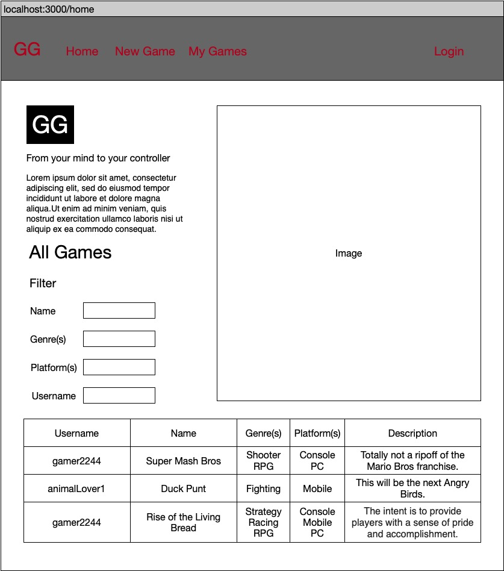
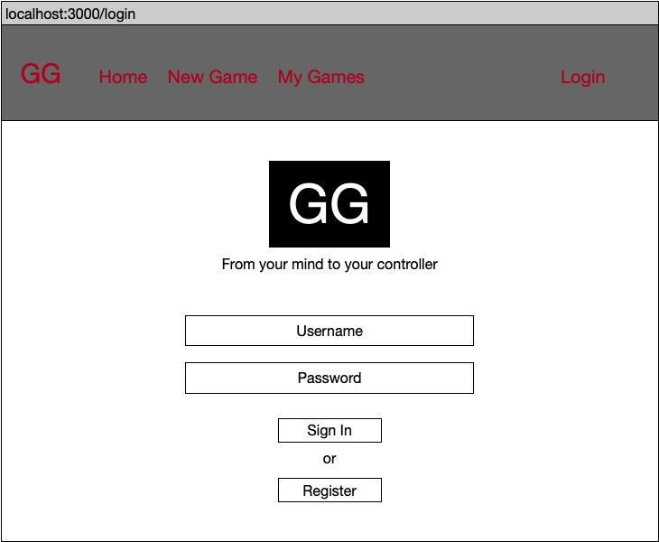
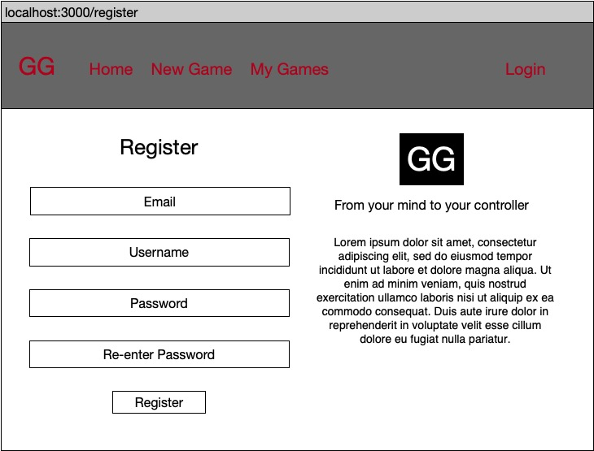
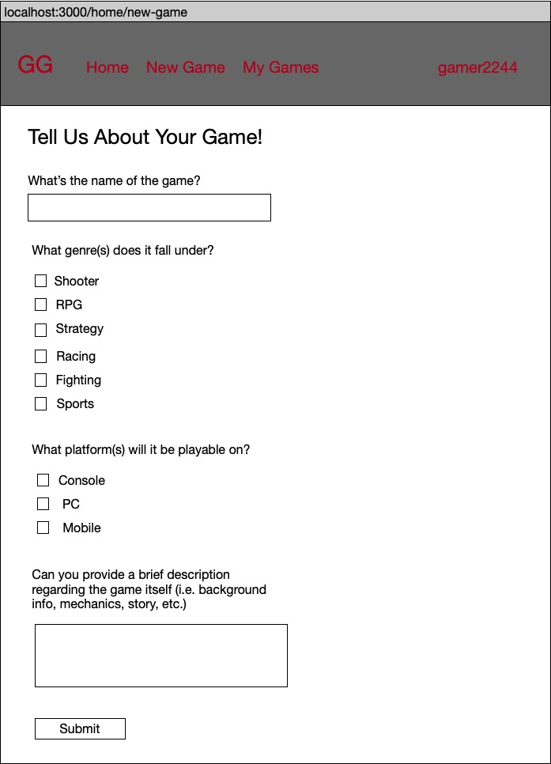
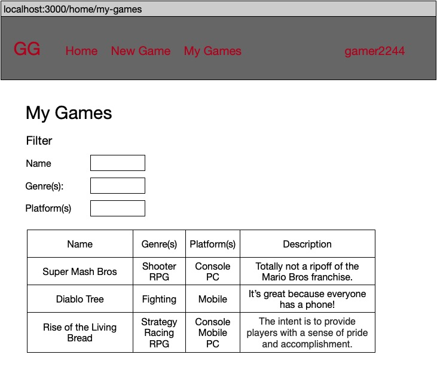
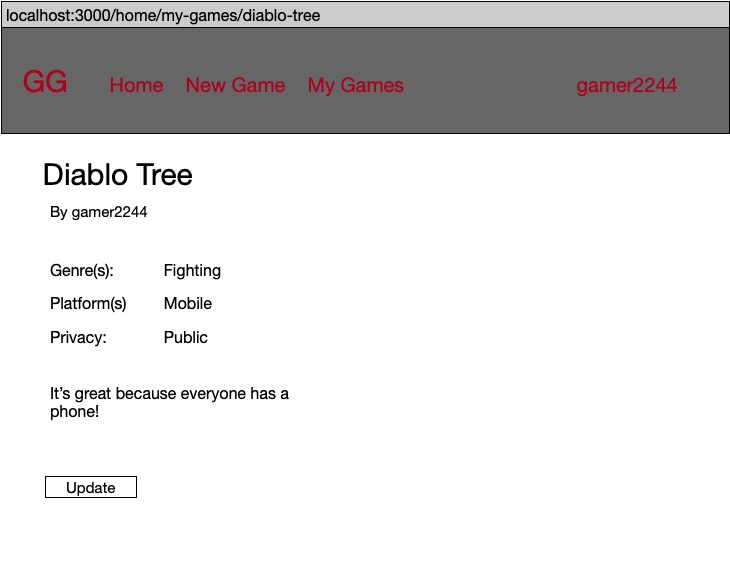
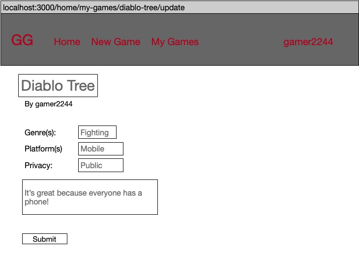
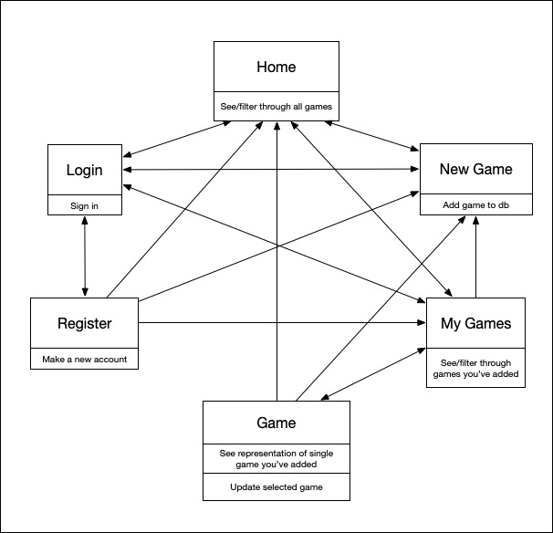

# Global Gaming

## Overview

Ever had a great idea for a video game and thought, "Wow, my idea could be the next Mario Bros but I have absolutely no coding experience whatsoever. If only I could entrust my billion-dollar idea to someone capable of making it a viable product!"

Introducing, Global Gaming (GG)! Here at GG, we strive to take your ideas from your mind to the player's hands.

GG is a web app that will allow users to submit their amazing game ideas. Users will register and login. Once logged in, they can submit their incredible game ideas and then chat with other game enthusiasts to collaborate. Users that aren't logged in can still see all public games submitted to the site.

## Data Model

The application stores Games and their respective User, as well as Chatroom and Message models for real-time chat.

* Each Game has one User reference
* Each Message has one Chatroom reference
* Each Chatroom holds multiple User references

An Example User:

```javascript
{
  firstName: "John", //first name of user
  lastName: "Doe", //last name of user
  username: "xXxNoSc0peGamerxXx", //username to login
  password: // a password hash,
  email: "gamerGirl@gmail.com"
}
```

An Example List with Embedded Items:

```javascript
{
  user: // a reference to a User object
  title: "Super Mash Bros", //title of game
  privacy: "public" //game is either private or public to other users
  genre: "RPG", //genre of game
  platform: "PC", //platform game will launch on
  desc: "Totally not a ripoff of the Mario Bros franchise.", //game description
}
```

## [Link to Models](models)

## Wireframes

/home - homepage; can see/filter through all games that have been added to db



/login - page for logging in to site



/register - page for registering for the site



/home/new-game - page for adding a new game to db



/home/my-games - page for viewing games submitted by user



/home/my-games/game - representation of single game from My Games



/home/my-games/game/update - update single game from My Games



## Site map



## User Stories or Use Cases

1. as non-registered user, I canj
  * register a new account so I can
    * add a new game to the database
    * view games that I've added to the database
    * chat with other users
  * view all public games that have been added to the database
2. as a user, I can
  * log in to the site so I can
    * add a new game to the database
    * view games that I've added to the database
    * chat with other users
  * view all games that have been added to the database

## Grading Rubric
* (12 points) minimum 3 x forms or ajax interactions (excluding login)
  * [New Chatroom Form](views/chatrooms.jade)
  * [New Message Form](views/messages.jade)
  * [New Game Form](views/new-game.jade)
  * [Filter Games Form](views/index.jade)

* (6 points) minimum 3 x any of the following (can be the same): Array.prototype: map, reduce, filter
  * [map - line 101](app.js)
  * [reduce - line 29](controllers/GameController.js)
  * [filter - line 172](app.js)

* (2 points) minimum 2 x mongoose schemas
  * [Models](models)

* (8 points) stability / security
  * Using Passport for authentication
    * [Passport Setup](app.js)
    * [Passport Implementation](controllers/AuthController.js)
  * [Included checks to make sure user is logged in](controllers/GameController.js)
  * [Games marked as private will only be visible by the original creator](controllers/GameController.js)

## Research Topics

* (1 points) Use CSS Framework (Bootstrap)
  * [Bootstrap](views)
* (2 points) Using Jade for templating instead of hbs
  * [Jade Ex](views)
* (3 points) Integrate User Authentication (Passport)
  * [Strategy Setup, Initialization, and Serialization](app.js)
  * [AuthController](controllers/AuthController.js)
* (4 points) Using Socket.io for real-time chat
  * [Server-Side](app.js)
  * [Client-Side](public/js/messaging.js)
  * [ChatController](controllers/ChatController)

## [Link to Main Project File](app.js)

## Annotations / References Used

1. [Bootstrap tutorial](https://getbootstrap.com/docs/4.1/getting-started/introduction/)
2. Passport
  * [Passport Documentation](http://www.passportjs.org)
  * [Node.js, Express.js, Mongoose.js and Passport.js Authentication](https://www.djamware.com/post/58bd823080aca7585c808ebf/nodejs-expressjs-mongoosejs-and-passportjs-authentication)

3. Jade
  * [Creating a Registration Form With Pug (Jade)](https://teamtreehouse.com/library/creating-a-registration-form-with-pug-jade-2)

  //code used from https://blog.slatepeak.com/creating-a-real-time-chat-api-with-node-express-socket-io-and-mongodb/


4. Socket.io
  * [Creating a Real Time Chat API with Node, Express, Socket.io, and MongoDB](https://blog.slatepeak.com/creating-a-real-time-chat-api-with-node-express-socket-io-and-mongodb/)
  * [Build a Chat App with MongoDB & Socket.io](https://www.youtube.com/watch?v=8Y6mWhcdSUM)
  * [How to build a real time chat application in Node.js using Express, Mongoose and Socket.io](https://medium.freecodecamp.org/simple-chat-application-in-node-js-using-express-mongoose-and-socket-io-ee62d94f5804)
